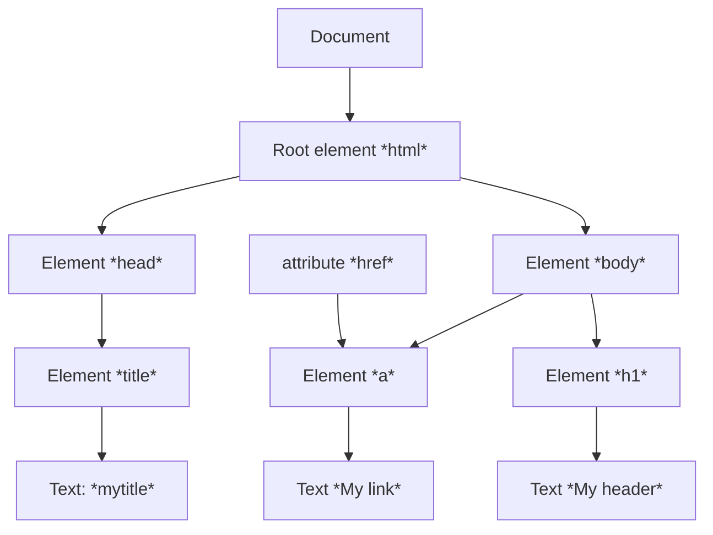

- **JavaScript** viene sviluppato nel 1995 da netscape con il nome *LiveScript*. In seguito si unisce anche Sun Microsystems, creatrice del linguaggio Java
- Si basa sulle specifiche standard della European Computer Manufactures Association
- Permette di definire degli *script*,  anche frammentati all'interno del documento
#### JavaScript vs Java
- *JavaScript* non è un sottoinsieme del linguaggio *Java*
- *Java* è un linguaggio *Object Oriented*, *JavaScript* NO
- NON supporta l'ereditarietà
- A differenza di *Java*, *JavaScript* non richiede le dichiarazioni delle variabili e permette una tipizzazione dinamica
	- E' sempre comunque opportuno dichiarare le variabili esplicitamente
### Scripting non intrusivo
È focalizzato sull'utente ed è progettato per migliorare una struttura di markup già di per sé semantica ed accessibile. In particolare:
- non attira l'attenzione dell'utente, è un'aggiunta funzionale al sito ovvio (*migliora usabilità*)
- non attira l'attenzione dell'utente quando non funziona (*degrado aggraziato*)
- non modifica le funzionalità della pagina, se non funziona l'utente non deve accorgersi che manca (_accessibilità_)
- non modifica la struttura della pagina (*separazione struttura - comportamento*)
# JavaScript
È un linguaggio piuttosto semplice, che permette di creare documenti dinamici, in grado di interagire con l'utente
- Dare un messaggio se l'utente fa un click con il tasto destro del mouse
A differenza di [[PHP]], non supporta il networking e le operazioni sui file anche se queste ultime trovano parziale supporto con le File API di [[HTML5]]
- *cookie*
*D*ocument *O*bject *M*odel (*DOM*): permette agli script *JavaScript* di avere accesso ai contenuti e ai widget del documento [[HTML]] in cui sono contenuti
- Calcoli basati sugli eventi
## Inserire script in pagine web
- Possono apparire sia nell'header di un file HTML che nel corpo, con funzioni molto diverse:
	- **header**: servono per produrre contenuto su richiesta o si occupano dell'interazione con l'utente. In generale, definizioni di funzioni che vengono riutilizzate più volte
		- *Ex. codice associato agli elementi di un form*
	- **body**: script da interpretare una volta sola
		- *Ex. controllo di un dato specifico*
- Come per il CSS, gli script inseriti nell'intestazione sono inseriti tra commenti 
 `<!-- codice Javascript.//-->`
 - Commenti JavaScript: 
 `// oppure /**/ stile C e C++`
##### Esempio script all'interno del body
```HTML
<html>
	<head>
		<title>Pagina di Esempio</title>
	</head>
	<body onLoad="alert('Messaggio di apertura');">
		<p>Pagina di esempio con un alert.</p>
	</body>
</html>

<!--Browser che non supportano gli script-->
<script type="text/Javascript">
	<!--codice dello script-->
</script>
<noscript>
	<meta http-equiv="refresh" content="0;" url="altrapagina.html">
</noscript>
```
## Gli oggetti e variabile JavaScript
- Ogni oggetto ha un insieme di proprietà 
	- proprietà di *dati*
	- proprietà di *metodi*
- I tipi che non sono oggetti vengono chiamati primitive
- Per riferirsi alle proprietà di un oggetto si usa la forma `nome_variabile.nome_proprietà`
	- automobile.modello
	- automobile.gira(90)
- I nomi di variabili possono contenere lettere, cifre (non al primo posto), `_`, $, e non devono essere uguali alle stringhe utilizzate per i comandi (parole riservate)
	- per convenzioni non si usano lettere maiuscole e il segno del dollaro
### Primitive ed oggetti
- number (Number)
- string (String)
- boolean (Boolean)
- undefined
- null / NaN
- variabili con le *var*
- Letterali numerici
	- 12, 12, 12, 12... come in PHP
- Letterali stringa
	- "questa è una stringa", 'anche questa e\' una stringa'
- Operatori numerici
	- `+ - * / ++ --`
- Oggetti specifici includono una serie di operazioni e costanti di uso frequente
	- Oggetti Math e Number
## Tipi
- JavaScript supporta la tipizzazione dinamica
	- `1 + "Aprile" + 2005`
	- `14 * "3"`
	- `1 * "Aprile" -> NaN`
- `.toString`converte i numeri in stringa ove è necessario
- *typeof* restituisce stringa descrittiva del tipo
- *instanceof* verifica se l'operando è stato creato con funzione costruttore
#### Output
- `document.write("<p>Testo paragrafo</p>");`
- `alert("Messaggio \n su più righe");`
- `var question = confirm("Salvare il file?");`
- `input = prompt("Inserisci la login:", "guest");` 
#### Istruzioni condizionali
- Sono uguali a quelle di *PHP*, ma non è obbligatorio l'uso dei blocchi
	- if (espressione di controllo) istruzione
	- `nome_variabile=(condizione)?valore_se_vero:valore_se_falso`
### Cicli
```JavaScript
while(espressione di controllo){
	#istruzioni del ciclo
}

for(inizializzazione; espr. di controllo; incremento){
	#istruzioni del ciclo
}

do{
	#istruzioni del cicloo
}while (espressione di controllo)
```
## Creazione e modifica di oggetti
- Quando viene creato, un oggetto è vuoto e privo di proprietà
	- `var occhiale = new Object();`
- Le proprietà vengono istanziate dinamicamente
	- `occhiale.tipo = "solari";`
	- `occhiale.marca = "Rayban";`
- Accesso alle proprietà:
	- `for(var prop in occhiale) istruzione`
- Le proprietà possono essere eliminata
	- `delete occhiale.marca;`
```JavaScript
function marca_occhiale(){
	document.write(this.marca);
}
function occhiale(ntipo, nmarca){
	this.tipo = ntipo;
	this.marca = nmarca;
	this.print_marca = marca_occhiale;
}
```
### Array
- Sono oggetti che svolgono alcune funzioni speciali
	- `var lista = new Array(1, 2, "tre", "quattro");`
	- `var lista_vuota = new Array(100);`
	- `var lista_spesa = ["pane", "latte", "birra"];`
	- `lista_spesa[1] -> "latte"`
	- `lista.length -> 4`
- Altri metodi:
	- `lista_spesa.join(";"); -> "pane; latte; birra"
	- `lista_spesa.sort(); -> ["birra", "latte", "pane"];
	- `var nuova_lista = lista_spesa.concat(5.6)`
	- *slice*: come substring per le stringhe
	- *pop, push, shift, unshift*
##### Array associativi
- JavaScript prevede anche la definizione di array associativi:
	```
	 voti = new Array();
	 voti["Mario"] = 7;
	 voti["Gianni"] = 4;
	 voti["Monica"] = 4;
	oppure
	 var voti = {"Mario":"7", "Gianni":"4", "Monica":"4"};
	```
### Scope delle variabili
- Le variabili vengono dichiarate con la parola chiave *var*
	- `var x = 5, y = 7, mese 'Aprile'`
- Lo scope di una variabile è legato alle funzioni. Se definita all'interno di una funzione, indipendentemente da dove è definito lo scope è l'intera funzione
- Se definito fuori da una funzione la variabile è globale
- Se una variabile non viene dichiarata (tramite la parola chiave var) questa è automaticamente un variabile globale
### Funzioni
```
function scrivi_nome([arg1, ...,arg2]){
	//inizializzo le variabili all'interno delle funzioni
	var nome=prompt("inserisci qui il tuo nome", "il tuo nome");
}
scriviNome();
nome = "Gianni"; //in questa è (nuova) variabile globale
```
I parametri di una funzione possono variare nel numero
- array *arguments*
## Corrispondenza dei pattern
- Ripresi dal linguaggio *PHP* ma utilizzando i metodi dell'oggetto *String*
	- *search*
	- *replace*
	- I modificatori vengono usati come parametri per i metodi
# Browser Object Model (BOM)
- Il BOM è un modello ad oggetti, *non standardizzato* e privo di specifica che consente di interagire con il browser

Elemento | Oggetto
----- | ------
Browser| navigator
Finestra | window
Frame | window.frames["ID Frame"]
Barra indirizzi | location
Barra di stato | status

**METODI BOM**
- L'oggetto window rappresenta la finestra (*o scheda*) del browser. Può essere omesso nella chiamata alle sue proprietà o metodi perchè usato implicitamente
- La funzione *open* permette di aprire una nuova finestra
##### Apertura di una nuova finestra
- Questa soluzione si trasforma elegantemente perchè se javascript non è abilitato apre il link nella stessa pagina
`<a href="http://www.example.com/" onclick="popUp(this.href); return false;">Example</a>
```
function popUp(winURL){
	window.open(winURL, "popup", "width=320, height=480");
}
window.open(url, nome, lista_di_features);
```
- Per i dispositivi touch `ontouchend`
- Questa soluzione presenta la separazione tra comportamento e struttura
```HTML
<a href="http://www.example.com/" class="popup">Example</a>
```
```JavaScript 
var links = document.getElementsByTagName("a");
for (var i=0; i<links.length, i++){
	if(links[i].getAttribute("class") == "popup"){
		links[i].onclick = function() {
			popUp(this.getAttribute("href"));
			return false;
		}
	}
}

window.onload = linkNuovaFinestra;
function linkNuovaFinestra(){
	var links = document.getElementsByTagName("a");
	for(var i = 0; i<links.length; i++){
		if(links[i].getAttribute("class") == "popup"){
			links[i].onclick = function(){
				popUp(this.getAttribute("href"));
				return false;
			}
		}
	}
}

function popUp(url){
	window.open(url; "nuovaFinestra", "width=320, height=480");
}
```
# Document Object Model (DOM)
- Il **DOM** permette di accedere ai diversi elementi di una pagina web. È uno standard, con supporto oramai completo.
- La pagina è divisa in vari elementi in relazione tra loro

Elemento | Oggetto
------|------
Pagina web | `window.document` o `document`
Form | `document.forms["ID form"]`
Immagini | `document.images["ID immagine"]`
- Il DOM HTML permette di modificare, aggiungere o rimuovere elementi HTML in modo standard, con supporto oramai completo

### JavaScript e HTML
- Posso accedere ad un tag tramite `getElementsByTagName`o `getElementById`
- Ogni elemento dell'array *forms*, contiene un array *elements* con gli elementi del form (pulsanti, caselle di testo ecc...)
- Un documento DOM ha una struttura ad albero

32/67

