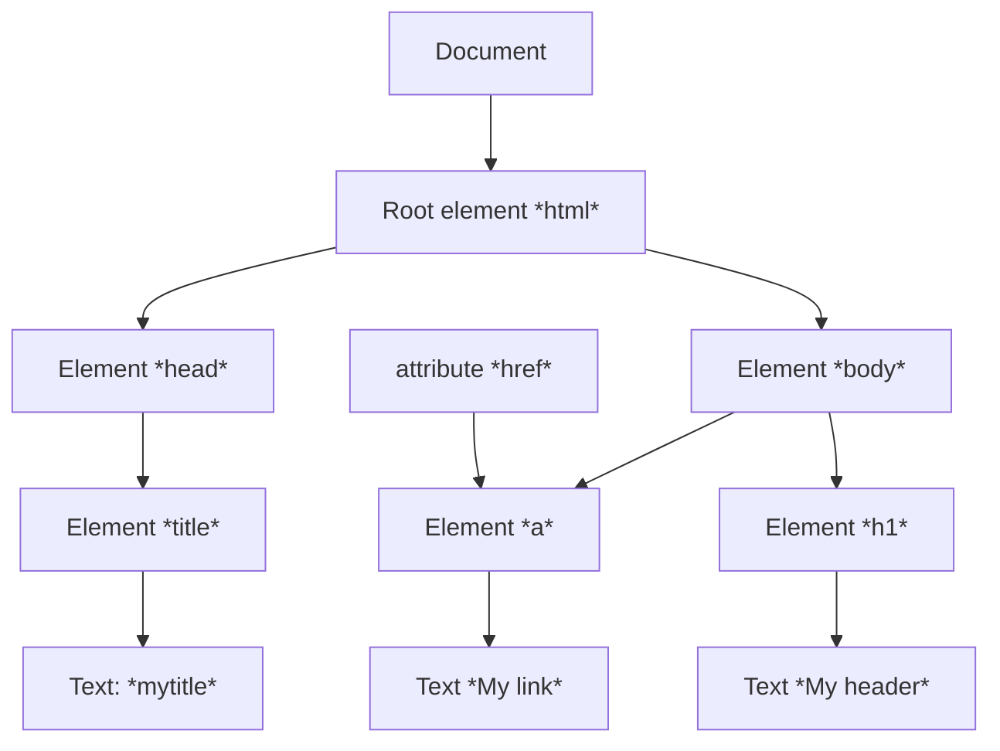

- **JavaScript** viene sviluppato nel 1995 da netscape con il nome *LiveScript*. In seguito si unisce anche Sun Microsystems, creatrice del linguaggio Java
- Si basa sulle specifiche standard della European Computer Manufactures Association
- Permette di definire degli *script*,  anche frammentati all'interno del documento
#### JavaScript vs Java
- *JavaScript* non è un sottoinsieme del linguaggio *Java*
- *Java* è un linguaggio *Object Oriented*, *JavaScript* NO
- NON supporta l'ereditarietà
- A differenza di *Java*, *JavaScript* non richiede le dichiarazioni delle variabili e permette una tipizzazione dinamica
	- E' sempre comunque opportuno dichiarare le variabili esplicitamente
### Scripting non intrusivo
È focalizzato sull'utente ed è progettato per migliorare una struttura di markup già di per sé semantica ed accessibile. In particolare:
- non attira l'attenzione dell'utente, è un'aggiunta funzionale al sito ovvio (*migliora usabilità*)
- non attira l'attenzione dell'utente quando non funziona (*degrado aggraziato*)
- non modifica le funzionalità della pagina, se non funziona l'utente non deve accorgersi che manca (_accessibilità_)
- non modifica la struttura della pagina (*separazione struttura - comportamento*)
# JavaScript
È un linguaggio piuttosto semplice, che permette di creare documenti dinamici, in grado di interagire con l'utente
- Dare un messaggio se l'utente fa un click con il tasto destro del mouse
A differenza di [[PHP]], non supporta il networking e le operazioni sui file anche se queste ultime trovano parziale supporto con le File API di [[HTML5]]
- *cookie*
*D*ocument *O*bject *M*odel (*DOM*): permette agli script *JavaScript* di avere accesso ai contenuti e ai widget del documento [[HTML]] in cui sono contenuti
- Calcoli basati sugli eventi
## Inserire script in pagine web
- Possono apparire sia nell'header di un file HTML che nel corpo, con funzioni molto diverse:
	- **header**: servono per produrre contenuto su richiesta o si occupano dell'interazione con l'utente. In generale, definizioni di funzioni che vengono riutilizzate più volte
		- *Ex. codice associato agli elementi di un form*
	- **body**: script da interpretare una volta sola
		- *Ex. controllo di un dato specifico*
- Come per il CSS, gli script inseriti nell'intestazione sono inseriti tra commenti 
 `<!-- codice Javascript.//-->`
 - Commenti JavaScript: 
 `// oppure /**/ stile C e C++`
##### Esempio script all'interno del body
```HTML
<html>
	<head>
		<title>Pagina di Esempio</title>
	</head>
	<body onLoad="alert('Messaggio di apertura');">
		<p>Pagina di esempio con un alert.</p>
	</body>
</html>

<!--Browser che non supportano gli script-->
<script type="text/Javascript">
	<!--codice dello script-->
</script>
<noscript>
	<meta http-equiv="refresh" content="0;" url="altrapagina.html">
</noscript>
```
## Gli oggetti e variabile JavaScript
- Ogni oggetto ha un insieme di proprietà 
	- proprietà di *dati*
	- proprietà di *metodi*
- I tipi che non sono oggetti vengono chiamati primitive
- Per riferirsi alle proprietà di un oggetto si usa la forma `nome_variabile.nome_proprietà`
	- automobile.modello
	- automobile.gira(90)
- I nomi di variabili possono contenere lettere, cifre (non al primo posto), `_`, $, e non devono essere uguali alle stringhe utilizzate per i comandi (parole riservate)
	- per convenzioni non si usano lettere maiuscole e il segno del dollaro
### Primitive ed oggetti
- number (Number)
- string (String)
- boolean (Boolean)
- undefined
- null / NaN
- variabili con le *var*
- Letterali numerici
	- 12, 12, 12, 12... come in PHP
- Letterali stringa
	- "questa è una stringa", 'anche questa e\' una stringa'
- Operatori numerici
	- `+ - * / ++ --`
- Oggetti specifici includono una serie di operazioni e costanti di uso frequente
	- Oggetti Math e Number
## Tipi
- JavaScript supporta la tipizzazione dinamica
	- `1 + "Aprile" + 2005`
	- `14 * "3"`
	- `1 * "Aprile" -> NaN`
- `.toString`converte i numeri in stringa ove è necessario
- *typeof* restituisce stringa descrittiva del tipo
- *instanceof* verifica se l'operando è stato creato con funzione costruttore
#### Output
- `document.write("<p>Testo paragrafo</p>");`
- `alert("Messaggio \n su più righe");`
- `var question = confirm("Salvare il file?");`
- `input = prompt("Inserisci la login:", "guest");` 
#### Istruzioni condizionali
- Sono uguali a quelle di *PHP*, ma non è obbligatorio l'uso dei blocchi
	- if (espressione di controllo) istruzione
	- `nome_variabile=(condizione)?valore_se_vero:valore_se_falso`
### Cicli
```JavaScript
while(espressione di controllo){
	#istruzioni del ciclo
}

for(inizializzazione; espr. di controllo; incremento){
	#istruzioni del ciclo
}

do{
	#istruzioni del cicloo
}while (espressione di controllo)
```
## Creazione e modifica di oggetti
- Quando viene creato, un oggetto è vuoto e privo di proprietà
	- `var occhiale = new Object();`
- Le proprietà vengono istanziate dinamicamente
	- `occhiale.tipo = "solari";`
	- `occhiale.marca = "Rayban";`
- Accesso alle proprietà:
	- `for(var prop in occhiale) istruzione`
- Le proprietà possono essere eliminata
	- `delete occhiale.marca;`
```JavaScript
function marca_occhiale(){
	document.write(this.marca);
}
function occhiale(ntipo, nmarca){
	this.tipo = ntipo;
	this.marca = nmarca;
	this.print_marca = marca_occhiale;
}
```
### Array
- Sono oggetti che svolgono alcune funzioni speciali
	- `var lista = new Array(1, 2, "tre", "quattro");`
	- `var lista_vuota = new Array(100);`
	- `var lista_spesa = ["pane", "latte", "birra"];`
	- `lista_spesa[1] -> "latte"`
	- `lista.length -> 4`
- Altri metodi:
	- `lista_spesa.join(";"); -> "pane; latte; birra"
	- `lista_spesa.sort(); -> ["birra", "latte", "pane"];
	- `var nuova_lista = lista_spesa.concat(5.6)`
	- *slice*: come substring per le stringhe
	- *pop, push, shift, unshift*
##### Array associativi
- JavaScript prevede anche la definizione di array associativi:
	```
	 voti = new Array();
	 voti["Mario"] = 7;
	 voti["Gianni"] = 4;
	 voti["Monica"] = 4;
	oppure
	 var voti = {"Mario":"7", "Gianni":"4", "Monica":"4"};
	```
### Scope delle variabili
- Le variabili vengono dichiarate con la parola chiave *var*
	- `var x = 5, y = 7, mese 'Aprile'`
- Lo scope di una variabile è legato alle funzioni. Se definita all'interno di una funzione, indipendentemente da dove è definito lo scope è l'intera funzione
- Se definito fuori da una funzione la variabile è globale
- Se una variabile non viene dichiarata (tramite la parola chiave var) questa è automaticamente un variabile globale
### Funzioni
```
function scrivi_nome([arg1, ...,arg2]){
	//inizializzo le variabili all'interno delle funzioni
	var nome=prompt("inserisci qui il tuo nome", "il tuo nome");
}
scriviNome();
nome = "Gianni"; //in questa è (nuova) variabile globale
```
I parametri di una funzione possono variare nel numero
- array *arguments*
## Corrispondenza dei pattern
- Ripresi dal linguaggio *PHP* ma utilizzando i metodi dell'oggetto *String*
	- *search*
	- *replace*
	- I modificatori vengono usati come parametri per i metodi
# Browser Object Model (BOM)
- Il BOM è un modello ad oggetti, *non standardizzato* e privo di specifica che consente di interagire con il browser

Elemento | Oggetto
----- | ------
Browser| navigator
Finestra | window
Frame | window.frames["ID Frame"]
Barra indirizzi | location
Barra di stato | status

**METODI BOM**
- L'oggetto window rappresenta la finestra (*o scheda*) del browser. Può essere omesso nella chiamata alle sue proprietà o metodi perchè usato implicitamente
- La funzione *open* permette di aprire una nuova finestra
##### Apertura di una nuova finestra
- Questa soluzione si trasforma elegantemente perchè se javascript non è abilitato apre il link nella stessa pagina
`<a href="http://www.example.com/" onclick="popUp(this.href); return false;">Example</a>
```
function popUp(winURL){
	window.open(winURL, "popup", "width=320, height=480");
}
window.open(url, nome, lista_di_features);
```
- Per i dispositivi touch `ontouchend`
- Questa soluzione presenta la separazione tra comportamento e struttura
```HTML
<a href="http://www.example.com/" class="popup">Example</a>
```
```JavaScript 
var links = document.getElementsByTagName("a");
for (var i=0; i<links.length, i++){
	if(links[i].getAttribute("class") == "popup"){
		links[i].onclick = function() {
			popUp(this.getAttribute("href"));
			return false;
		}
	}
}

window.onload = linkNuovaFinestra;
function linkNuovaFinestra(){
	var links = document.getElementsByTagName("a");
	for(var i = 0; i<links.length; i++){
		if(links[i].getAttribute("class") == "popup"){
			links[i].onclick = function(){
				popUp(this.getAttribute("href"));
				return false;
			}
		}
	}
}

function popUp(url){
	window.open(url; "nuovaFinestra", "width=320, height=480");
}
```
# Document Object Model (DOM)
- Il **DOM** permette di accedere ai diversi elementi di una pagina web. È uno standard, con supporto oramai completo.
- La pagina è divisa in vari elementi in relazione tra loro

Elemento | Oggetto
------|------
Pagina web | `window.document` o `document`
Form | `document.forms["ID form"]`
Immagini | `document.images["ID immagine"]`
- Il DOM HTML permette di modificare, aggiungere o rimuovere elementi HTML in modo standard, con supporto oramai completo

### JavaScript e HTML
- Posso accedere ad un tag tramite `getElementsByTagName`o `getElementById`
- Ogni elemento dell'array *forms*, contiene un array *elements* con gli elementi del form (pulsanti, caselle di testo ecc...)
- Un documento DOM ha una struttura ad albero
### Gli eventi 
- Nella programmazione tradizionale il codice contiene in sé l'ordine in cui viene scritto
- Nella programmazione ad eventi si specificano funzioni (*event handler*) da eseguire all'occorrenza di un determinato evento
	- simile alla gestione delle eccezioni
	- `function unload_saluto(){ alert("Grazie per aver visitato il nostro sito!"); }`
- È importante scrivere correttamente l'evento a cui si vuole rispondere
-  event handler o chiamata di funzione su di un attributo specifico
	- `onclick = "alert('Stai uscendo da questo sito.');"`

Attributo | Tag
---------|-----
onabort | ``
onblur | `<body>,<form>,<frameset>,<frame>, etc...`
onchange | `<input>,<textarea>,<select>`
onclick | `<a>, <input>`
onerror | `,<body><frameset>`
onfocus | `<body>,<frameset>,<frame>,<input>, etc..`
onload | `, <body>, <frameset>`
onmouseover | `<a>,<area>`
## Gestire diversi dispositivi di Input
- Gli event pointer sono un'astrazione per le interazione basate su puntatore (mouse, stilo, tocco, altri futuri) che utilizzano eventi generici indipendenti dal puntatore
```JavaScript
window.addEventListener('pointerdown', detectInput, false)

function detectInput(event){
	switch(event.pointerType){
		case 'mouse': ...
			break;
		case 'touch': ...
			break;
	}
}
```
## Pagine dinamiche con JavaScript
- Il linguaggio JavaScript permette di posizionare e dimensionare gli oggetti contenuti nel documento HTML
- Può quindi essere usato per creare dinamicamente il documento in fase di caricamento (*onload*)
- La modifica dinamica lato client delle pagine web deve avvenire attraverso script non intrusivo
### Cosa si può rendere dinamico?
- Sulla base delle:
	- caratteristiche del browser
	- dimensioni della pagina
	- dell'input dell'utente
	- degli spostamenti del mouse e degli eventi in genere
- JavaScript è in grado di modificare
	- La posizione e la dimensione degli elementi
	- la caratteristiche di stile (colore, font disponibili, etc..)
	- il contenuto e la sua struttura
- Oppure può dare dei messaggi di aiuto e/o avviso
### L'oggetto Navigator
- Indica quale browser sta utilizzando l'utente
	- appName indica il nome del browser
	- appVersion indica la versione
- Esempio
	- `alert("il browser usato è: " +navigator.appName + "\n" + navigator.appVersion + "\n");`
- Conoscere quale browser sia sta utilizzando è utile perchè in alcuni casi bisogna predisporre codice differente per i diversi browser
	- **_code Forking_**: da **NON** utilizzare, ma diventa inevitabile se gli oggetti non sono definiti in modo comune nel DOM
 **BISOGNA**
 -> Individuare di quale browser si tratta vuol dire richiedere un continuo aggiornamento dello script
 -> Uno script che testa il supporto al DOM non richiede aggiornamento
 ```JavaScript
 if(!document.getElementById){
	 window.location = "http://www.sito.it/altra_pagina.html";
 }
 ```
## Libreria Modernizr
- Il supporto ad [[HTML5]] e [[CSS]]3 non è ancora completo da parte di tutti i browser, inoltre c'è il problema dei browser non aggiornati 
- **Modernizr** è una libreria opensource che aiuta a testare le funzionalità e non il tipo di browser utilizzato
```JavaScript
if(Modernizr.video){
	//video supportato
} else { /*Video non supportato*/}
function isTagVideoSupported(){
	return !!document.createElement("video").canPlayType;
}
```
### Ordinare un array
```HTML
<button onclick="myFunction()">Ordina in modo ascendente</button>
<p id="demo"></p>
<script>
	var points = [40, 100, 1, 5, 25, 10];
	document.getElementById("demo").innerHTML = points;

	function myFunction(){
		points.sort(function(a,b){return a-b});
		document.getElementById("demo").innerHTML = points;
	}
</script>
```
## I cookie
- Sono piccoli file di testo memorizzati sul computer dell'utente, e scambiati tra client e server, che contengono informazioni salvate dai siti web
- Sono usati per memorizzare in modo permanente delle informazioni univoche rispetto ad un utente, in modo da poterlo riconoscere e/o poterle riusare 
	- *problemi di privacy*
- Si deve fare attenzione al fatto che i cookie possono essere eliminati o disabilitati dall'utente
- Ogni cookie contiene dei parametri, tra cui:
	- *nome*: identificativo per il cookie
	- *valore* : il valore da memorizzare
	- *scadenza* (*expiration date*): è opzionale, stabilisce la data di scadenza del cookie, cioè la data dopo la quale questi vengono eliminati dal disco rigido dell'utente
#### Creazione e distruzione di un cookie
```Javascript
//imposta il cookie con nome = valore per la durata di giorni
function setCookie(nome, valore, giorni){
	var oggi = new Date();
	var scadenza = new Date();
	scadenza.setTime(oggi.getTime() + 24*giorni*3600000);
	document.cookie = nome + "=" + escape(valore) +"; expires=" + scadenza.toGMTString();
}
// rimuove un cookie
function delCookie(nome){
	setCookie(nome, "");
}
```
#### Accesso ad un Cookie
```
//restituisce il valore del cookie nome
function getCookie(nome){
	//genera un array di coppie "Nome = Valore" separate da ';'
	var asCookies = document.cookie.split(";");
	var stringa="";
	//ciclo su tutti i cookies
	for(var i=0; i<asCookies.length; i++){
		//leggo singolo cookie "Nome = Valore"
		var info = asCookies[i].split("=");
		if (nome == info[0]){
			stringa = unescape(info[1]);
		}
	}
	return stringa; //stringa="" se il cookie non esiste
}
```
#### Utilizzo del Cookie per riconoscere un utente
```Javascript 
function legginome(){
	var nome=prompt("Inserisci il nome");
	setCookie("utente", nome, 2);
	leggiutente();
}

function leggiutente(){
	var utente=getCookie("utente");
	if (utente!="") stringa_path = "Bentornato" + utente + "...";
	dpcument.getElementById("path").innerHTML = stringa_path;
}
```
```HTML
<body onload="leggiutente();">
...
<a href="javascript:legginome();">Crea un cookie con il tuo utente</a>
```
##### Altro modo di memorizzare i dati su client
- Il sempre più frequente uso dei telefonini impone di non fare sempre affidamento sulla rete
	- l'utente si sposta anche in zone dove non è presente il segnale
- I cookie hanno un limite di 4093KB per tutti i cookie di un dominio
- Soluzione: *localStorage*, *sessionStorage*, *indexedDB*
```Javascript 
if ('localStorage' in window && window.localStorage !==null){
	//possiamo usare localStorage
	localStorage.setItem('key', 'value');
	localStorage.setItem('myObject', JSON.stringify(myObject));
	...
	var myValue = localStorage.getItem('key');
	var myObject = JSON.parse(localStorage.getItem('myObject'));
}
```
## AJAX
- è l'acronimo di *Asynchronous JavaScript and XML* e realizza uno scambio asincrono di dati
	- lo scambio di dati avviene in background 
	- non è richiesto di ricaricare la pagina
- La pagina HTML chiamante deve contenere 
	- la chiamata allo script JavaScript (pulsante o evento)
	- un elemento (ex. div, select, etc) dove inserire il contenuto
#### Creazione oggetto XMLHttp
```Javascript
function getXMLHttp(){
	var xmlHttp;
	try{
		xmlHttp = new XMLHttpRequest();
	}catch(e){ //internet Explorer usa un oggetto Active X
		try{
			xmlHttp = new ActiveXObject("Msxml2.XMLHTTP");
		}catch(e){
			try{
				xmlHttp = new ActiveXObject("Microsoft.XMLHTTP");
			}catch(e){
				alert ("Messaggio di errore per i vecchi browsers"); return false; 
			}
		}
	}
	return xmlHttp;
}
```
##### Esempio
```Javascript
function AjaxRequest(){
	var xmlHttp = getXMLHttp();
	xml Http.onreadystatechange = function(){ //quando l'operazione è completata
		if(xmlHttp.readyState==4){
			inserisciTesto(xmlHttp.responseText);
		}
	}
	xmlHttp.open("GET", "ScriptPHP.php", true);
	xmlHttp.send(null);
}
function inserisciTesto(response){
	document.getElementById('IDdoveInserire').innerHTML = response;
}
```
### JQuery
- Library JavaScript per manipolazione di HTML, CSS ed eventi
- $('qualcosa') restituisce un array di elementi ([n])
	- `#id`
	- `.classe`
	- Elemento (li, a, div)
- `$(''#formInput').on(evento, function() {})`
- Modifica dello stile tramite style o con addClass/removeClass
- `$(document).ready()`eseguito solo quando il DOM è pronto per essere manipolato
## Utilizzo di librerie esterne
È molto importante assicurarsi che le librerie esterne siano disponibili perché ci sono stati diversi esempi nella storia del web di blackout di siti dovuti all'indisponibilità di una libreria esterna
- Gawker Media, 2011
- Sky Broadband, 2014
- Morale: *ci sono troppi fattori su cui non abbiamo il controllo quando eseguiamo codice su browser*
### Alcune regole per il progressive enhancement
- Progettare una versione base che funzioni senza JavaScript
	- Anche nel caso di errore più catastrofico gli utenti saranno in grado di eseguire le funzionalità di base
- Programmare sulla difensiva
	- A differenza di HTML o CSS, Javascript non è tollerante ai guasti basta 1 solo errore e si ferma l'esecuzione
	- Guardare prima di agire: non si può dare per scontata la presenza di altri elementi oltre a *html, head e body*, si deve cercare un elemento prima di usarlo
	- Delegare i comportamenti: l'ascolto degli eventi può essere fatto sull'elemento *body* che poi cerca l'elemento a cui siamo interessati
	- Testare il supporto alle caratteristiche 
	- Controllare la presenza delle librerie
	- Stabilire requisiti minimi
	- Tagliare le perdite
## Event delegation
- *Event delegation* è un pattern molto utile per gestire il DOM
- Consiste nel delegare la gestione di una risposta ad un evento uguale per molti elementi ad un elemento contenitore:
	- Si mette l'handler nell'elemento contenitore
	- Si verifica che elemento ha scatenato l'evento (*event.target*)
	- Se l'evento si è verificato all'interno di un elemento che dobbiamo gestire si esegue la funzione associata con l'handler
#### Esempio
```JavaScript
contatiner.onclick = function(event){
	if (event.target.className != 'remove-button') return;

	let pane = event.target.closest('.pane');
	pane.remove();
};
```
### Pro e contro
**PRO**:
- Semplifica e diminuisce i bit: si usa un solo handler
- Maggiore flessibilità: se si aggiungono o rimuovono componenti, non c'è necessità di modifiche al codice
**CONTRO**
- Maggiore richiesta di CPU perchè l'handler sul container potrebbe attivarsi anche per eventi, a qualunque livello, che in realtà non andrebbero gestiti
##### Controllare i requisiti minimi
```JavaScript
if('querySelector' in document && 'localStorage' in windows && 'addEventListener' in window){
	//browser HTML5
}
```
